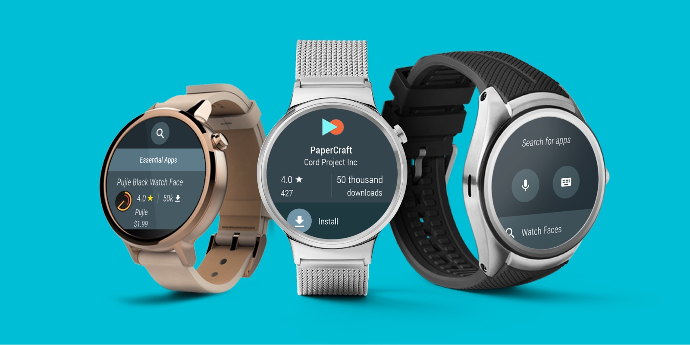

**Wij hebben geopteerd om voor deze applicatie in de eerste instantie gebruik te maken van Android toestellen. Mede omwille van de klassieke vorm van de Android Wear smartwatches dat een mooi contrast kan vormen met een strak, modern ontwerp**

Android Wear (Moto 360 2nd gen) - Relevante specificaties
--------
{: .img_border}

-  **Wifi**
-  **Bluetooth (4.2)**
-  Accelerometer
-  Gyroscoop
-  **Hartritmesensor**
-  Lichtsensor
-  **Haptische feedback (vibratie)**
-  Scherm: 360x330px, 233ppi (46mm) - 360x325px, 293ppi (42mm)
-  Touchscreen
-  **Dubbele microfoon**
-  Swipen
-  In staat simpele 3D voorstellingen vlot weer te geven
-  Digitale verstelknop:
   -  Eén druk = Terug naar home
   -  Double click = Terug
   -  Ingedrukt houden = Activeert Assistant

### Handige aspecten: 
-  **Wifi & bluetooth:** Cruciaal om indoornavigatie te kunnen gebruiken en de positie van de gebruiker accuraat te bepalen.
-  **Hartritmesensor & vibratie** Onmisbaar voor het ontwikkelen van een extra 'unieke' ervaring i.v.m. beleving en extra data voor UXC.
-  **Dubbele microfoon** Geeft de mogelijkheid om de gids te sturen of om contact te maken met de app.
-  **GPU voor 3D** Is in staat om simpele 3D voorstellingen weer te geven voor een extra dimensie in de navigatie.
-  **Accelerometer & Gyroscoop** Broodnodige sensors om accuraat objecten in een digitale variant van een bestaande ruimte te plaatsen.

Google Pixel 2  - Relevante specificaties
--------

{: .img_border}

-  Scherm: 1920 x 1080px, 441ppi (145.7 x 69.7mm) - 2560 x 1440px, 538ppi (157.9 x 76.7mm)
-  Multitouch Always-on display (95% DCI-P3)
-  **2 x 12.2 MP camera + 8 MP camera**
-  **Intern compass**
-  **Afstandssensor**
-  **Barometer**
-  **Accelerometer**
-  Vingerafdrukscanner
-  laser
-  **GPS**
-  **Wifi**
-  Bluetooth 5.0
-  NFC 

### Handige aspecten:

-  **GPS en Barometer**: Handig voor het uitbreiden van de navigatie tussen de verschillende gebouwen (uitbreiding via bijvoorbeeld Google Maps)
-  **Camera**: Voor het scannen van QR-codes en eventueel herkenningselementen
-  **Wifi**: Voor het downloaden van datapakketen, voor bijvoorbeeld een expo die wilt gaan bezoeken (audio, info e.d.) en uiteraard om de indoornavigatie te laten werken. 