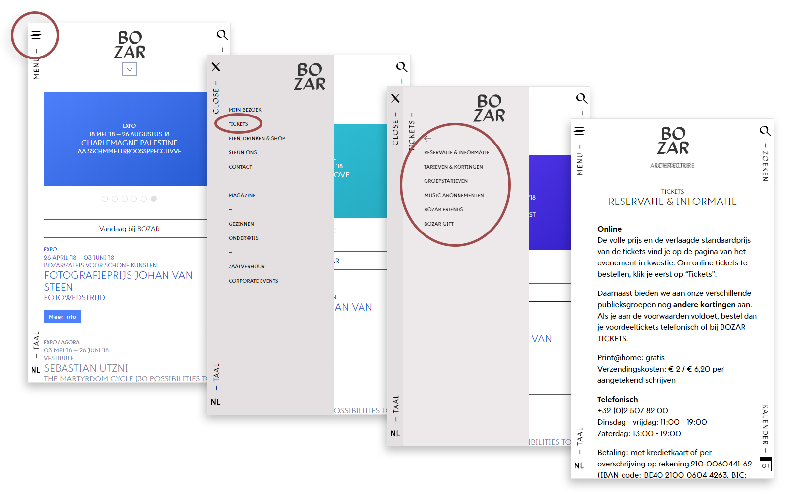

We proberen onze app naadloos te integreren zodat deze de ervaring makkelijker en misschien zelfs rijker maakt. De huidige app van Bozar bulkt van de submenu's, die voor zowat elke doelgroep een antwoord wil bieden op zijn mobiele en desktop website. 

De interface is daarom vrij eenvoudig gehouden en steunt voornamelijk op het speciaal ontworpen lettertype van Bozar door  [Coast](http://www.coast-agency.com/ "Coast Agency").
Wat wij willen doen is de belangrijkste functies meer in de verf zetten en de gebruiker in de zalen van Bozar te helpen. Zo moet een ticketing service beschikbaar blijven, eventueel samen met abonnementen. 

Verder willen wij gebruikers een eigen platform bieden, om tickets snel te delen, favorieten uit te wisselen en afspraken te maken om makkelijk samen naar het museum te gaan, maar tegelijkertijd de mogelijkheid open te laten om deze zaken te delen over andere sociale media.

*We merken ook dat de opstapeling van vensters op de website van Bozar het navigeren zeer bemoeilijkt, dit mag voor onze app uiteraard stukken eenvoudiger en overzichtelijker. Er is ook een gebrek (naar onze mening) aan afbeeldingen, er is een overload aan tekst op zowat elke pagina.*

{: .img_borderless}
